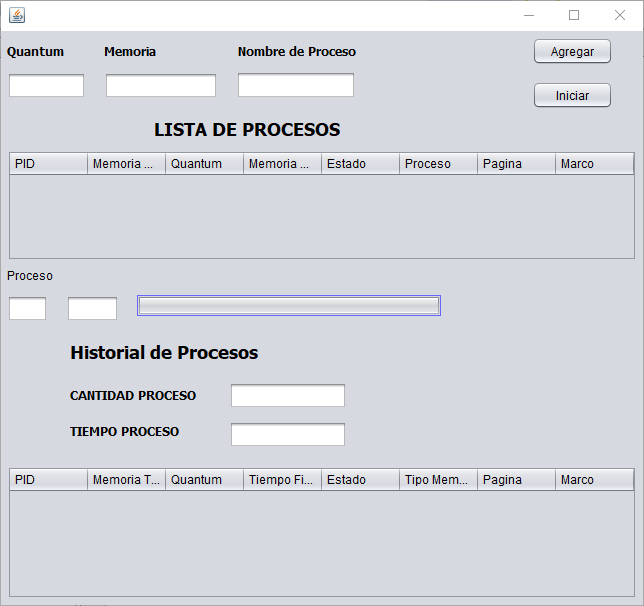
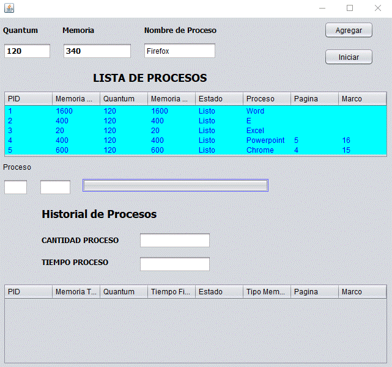
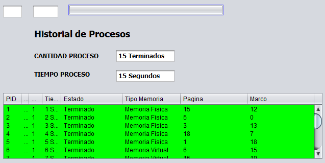

# PROYECTO FINAL
---
### Ejecutaremos el programa y nos aparecerá la pantalla principal donde debemos ingresar nuestros datos.
---

## Hacemos el llenado de informacion dentro del programa, ingresamos la memoria, el nombre del proceso y nos ira listando nuestros procesos.

## Una vez iniciado el programa nos mostrara el historial

## Cuando nuestra memoria se ha llenado y se necesita mas memoria, es cuando se comienzan a ejecutar las paginas y marcos.

## El programa muestra que han sido ejecutados y que se ha usado memoria fisica y virtual para la ejecucion de programas.
